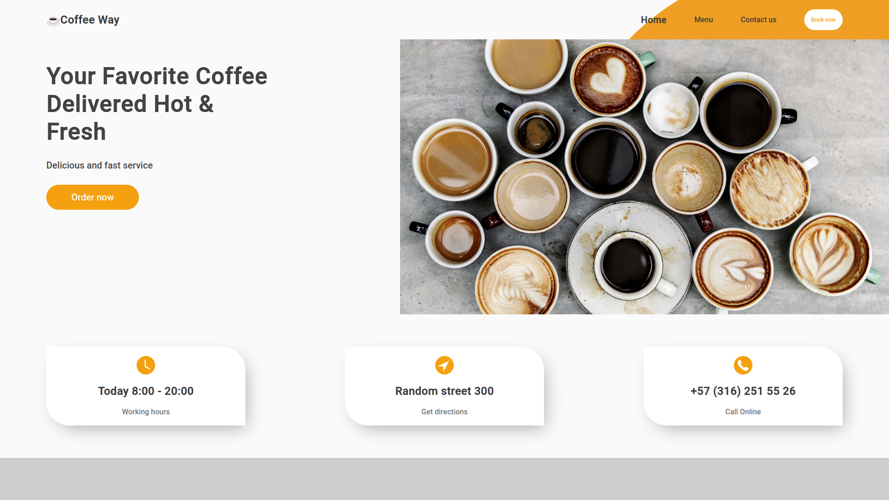
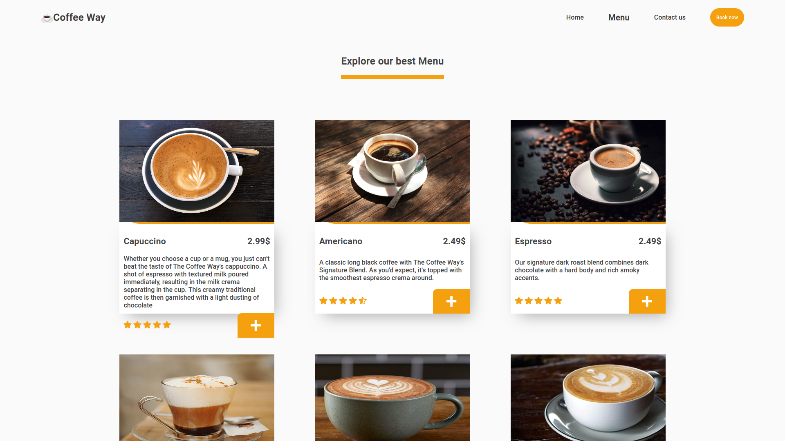

# Coffee way -Javascript

## Home

## Menu

## Usage

- Clone the repo "https://github.com/alvarorf/restaurant-page.git".
- Run "npm install" to install the required dependencies.
- Open the page.

## Technologies

- JavaScript
- Webpack
- CSS
- HTML
- VSCode

## Author

👤 **Alvaro Ruiz**

- Github: [@alvarorf](https://github.com/alvarorf)
- Twitter: [@aaruizf](https://twitter.com/aaruizf)
- Linkedin: [linkedin](https://www.linkedin.com/in/alvaro-r-22810915a/)

## 🤝 Contributing

Contributions, issues, and feature requests are welcome!

## Show your support

Give a ⭐️ if you like this project!

### Acknowledgements

- Microverse
- The Odin Project
